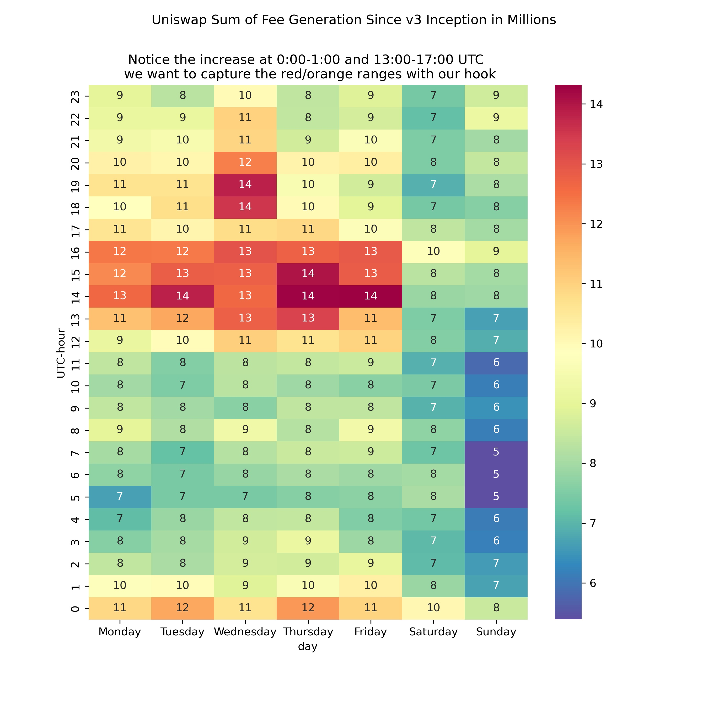
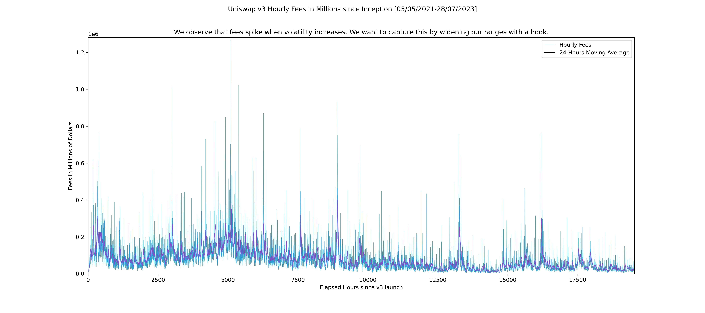

# Time Concentrate

## Overview


Uniswap V4 hook to restrict trading during NYSE hours and after hours when bots trade.

Inspired by Uniswap V4 hook for NYSE trading hours:

https://github.com/horsefacts/trading-days

## Foundry Uniswap V4 Setup
```shell
forge compile
```
manually install libraries if needed
```shell
forge install https://github.com/Uniswap/v4-core --no-commit
forge install https://github.com/Uniswap/periphery-next --no-commit
forge install https://github.com/OpenZeppelin/openzeppelin-contracts --no-commit
forge install https://github.com/bokkypoobah/BokkyPooBahsDateTimeLibrary --no-commit
forge install https://github.com/Vectorized/solady --no-commit
```

## Foundry deploy and verify contract code manually 
### Sepolia (Etherscan)
```shell
forge create --rpc-url $sepoliaInfuraHttps --etherscan-api-key $etherscanApiKey --verify --private-key $devTestnetPrivateKey src/TradingView.sol:TradingView
```
### Scroll [EIP-1559 not added yet]
#### Etherscan
```shell
forge create --legacy --rpc-url https://sepolia-rpc.scroll.io/ --etherscan-api-key D62920783A4311EE9D6600155D570C742E --verify --private-key $devTestnetPrivateKey src/TradingView.sol:TradingView --verifier etherscan --verifier-url https://api-sepolia.scrollscan.dev/api
```
or
```shell
forge verify-contract \
    --num-of-optimizations 200 \
    --watch \
    --verifier etherscan \
    --verifier-url https://api-sepolia.scrollscan.dev/api \
    --etherscan-api-key D62920783A4311EE9D6600155D570C742E \
    --compiler-version v0.8.20+commit.a1b79de6 \
    0x8FDDf2Fe177d16C2783b1F52dc71ABbc4366977B \
    TradingView
```
#### Blockscout
```shell
forge create --legacy --rpc-url https://sepolia-rpc.scroll.io/ --private-key $devTestnetPrivateKey src/TradingView.sol:TradingView --verify --verifier blockscout --verifier-url https://sepolia-blockscout.scroll.io/api\? 
```
or (deployed at address 0x8FDDf2Fe177d16C2783b1F52dc71ABbc4366977B already)
```shell
forge verify-contract 0x8FDDf2Fe177d16C2783b1F52dc71ABbc4366977B src/TradingView.sol:TradingView --chain-id 534351 --verifier-url https://sepolia-blockscout.scroll.io/api\? --verifier blockscout 
```

## Deployed and verified contract 

### Sepolia 

https://sepolia.etherscan.io/address/0xc7a03c696cec68b6675c3df09d83900cd5a40687#code

### Scroll

#### Etherscan

https://sepolia.scrollscan.dev/address/0x8FDDf2Fe177d16C2783b1F52dc71ABbc4366977B#code

#### Blockscout

https://sepolia-blockscout.scroll.io/address/0x8FDDf2Fe177d16C2783b1F52dc71ABbc4366977B/contracts#address-tabs

## Time Ranges

1 hook trading hours (UTC 23:59 - 1:00) AND (UTC 12:00 - 17:00)

---
EDT:  9:30 - 16:00 is UTC: 13:30 - 20:00

EDT:   19:59 - 21:00 is UTC: 23:59 - 1:00
---
----
2 volatility oracle with VolatilityOracle.sol
OR
volatility oracle by Ken form Uniswap https://github.com/ankitchiplunkar/v3-volatility-oracle : the function for getting volatility is: https://ankitchiplunkar.com/v3-volatility-oracle/howtouse/
OR
volatility calculation from Axiom
OR
post volatility on UMA
---

3 create two LP positions. 1 in +/- 2 volatility range (allocate 20% of LP position) and 2 in +/- 1 volatility range (allocate 80% of LP position).
---


# Horsefact trading hours info:
## 🗽 trading-days


A Uniswap v4 hook that reverts when markets are closed in New York.

### Views

- `isCoreTradingHours`: Return `true` between 9:30 AM and 4:00 PM ET.
- `isTradingDay`: Return `true` Mon-Fri, if it's not a NYSE holiday.
- `isHoliday`: Return `true` if it's a NYSE holiday.
- `getHoliday`: Get the current holiday (see the `Holiday` enum).
- `isDST`: Return `true` if it's Daylight Savings Time in New York.
- `time`: Adjust `block.timestamp` so that UTC date calculations are localized to US Eastern Time. Subtracts either 4 or 5 hours, depending on whether it's DST.
- `marketIsOpen`: Return `true` if the market is currently open.
- `state`: Get the current state of the market, one of:
  - `HOLIDAY`
  - `WEEKEND`
  - `AFTER_HOURS`
  - `OPEN`

### Errors

- `ClosedForHoliday(Holiday holiday)`: Markets are closed for a [NYSE holiday](https://www.nyse.com/markets/hours-calendars). Error data includes a Holiday enum, one of:
  - `NEW_YEARS_DAY`
  - `MARTIN_LUTHER_KING_JR_DAY`
  - `WASHINGTONS_BIRTHDAY`
  - `GOOD_FRIDAY`
  - `MEMORIAL_DAY`
  - `JUNETEENTH_NATIONAL_INDEPENDENCE_DAY`
  - `INDEPENDENCE_DAY`
  - `LABOR_DAY`
  - `THANKSGIVING_DAY`
  - `CHRISTMAS_DAY`
  - `NEW_YEARS_DAY_OBSERVED`
- `ClosedForWeekend`: Markets are closed for the weekend.
- `AfterHours`: Markets are closed on weekdays before 9:30 AM and after 4:00 PM ET.

### Events

- `DingDingDing`: If you perform the first swap of the day, you get to ring the opening bell!

### Deployments

| Network | TradingView                                                                                                                         |
| ------- | ----------------------------------------------------------------------------------------------------------------------------------- |
| Goerli  | [`0x000000006016c17169c289346015b3c9d42a1218`](https://goerli.etherscan.io/address/0x000000006016c17169c289346015b3c9d42a1218#code) |
| Mainnet | [`0x000000006016c17169c289346015b3c9d42a1218`](https://etherscan.io/address/0x000000006016c17169c289346015b3c9d42a1218#code)        |

### Technical Details

The NYSE holiday calendar and Daylight Savings start/end timestamps are stored as [data contracts](https://github.com/dragonfly-xyz/useful-solidity-patterns/tree/main/patterns/big-data-storage).

NYSE holidays were precalculated through 2123 using the Python [holidays](https://pypi.org/project/holidays/) package. Each 13-byte sequence encodes one year, which includes up to 11 holidays. Each holiday is encoded as 9 bits, 4 for the month and 5 for the day. A year may have 9, 10, or 11 holidays, depending on whether New Year's Day of the next year falls on a Saturday.

The start and end timestamps for Daylight Savings were precalculated through 2123 using the `calculate_dst.py` script in this repo. The data contract stores each start/end pair as an 8-byte sequence, encoding two 32-bit values representing seconds since Jan 1, 2023. These represent the exact start and end timestamp of Daylight Savings Time in New York, according to current [DST rules](https://www.nist.gov/pml/time-and-frequency-division/popular-links/daylight-saving-time-dst). (That is, DST starts at 2am local time on the second Sunday of March and ends 2am local time on the first Sunday of November).

### Acknowledgments

Inspired by [Mariano's](https://github.com/nanexcool) legendary "office hours" modifier:

<a href="https://twitter.com/nanexcool/status/1259623747339849729" target="_blank">
  
</a>

Thanks to:
- [saucepoint](https://twitter.com/saucepoint) for their [v4 hooks template](https://github.com/saucepoint/v4-template)
- [BokkyPooBah](https://twitter.com/BokkyPooBah) for [BokkyPooBahsDateTimeLibrary](https://github.com/bokkypoobah/BokkyPooBahsDateTimeLibrary)
### Alternative example of trading hours 

https://github.com/bennoprice/univ4/blob/main/src/TradingHours.sol 


### Hook #1 timing: 




### Hook #2 volatility for modifying ranges:




